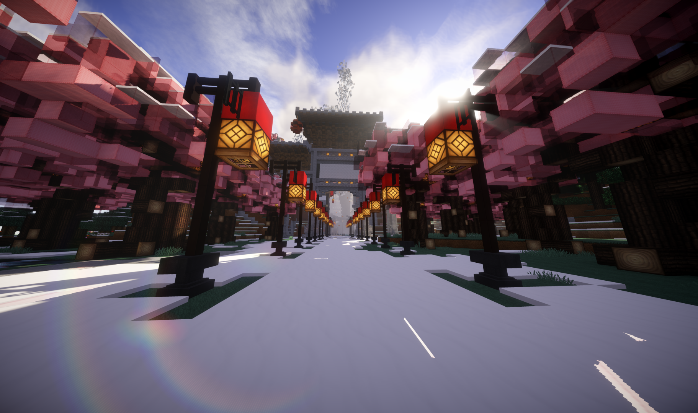

## 第一届建筑大赛
### 比赛公告：

### 比赛结果：
| 参赛玩家           | 坐标              | 描述                                                                                                                                                           | 分数（200）       | 奖品           |
| ------------------ | ----------------- | -------------------------------------------------------------------------------------------------------------------------------------------------------------- | ----------------- | -------------- |
| WHDS 和 cangXuann_ | -1532 71 758      | 桃花源 为了第一而来（就是建的爽记得切到黑夜和雪天噢                                                                                                            | 195               | 一等奖         |
| xiaoqijiang        | 183 64 326        | 现代建筑                                                                                                                                                       | 130               | 二等奖         |
| ZaneLiao           | 397 91 -87        | 筑在沙漠中的一泓清泉上，主体为沙丘，主要是为了沙漠中的旅行者提供停驻休息所用。在后面浅水湾可以作为港口使用，而富有层次感的圆形平台则增添了建筑的韵味。（未建完 | 125               | 二等奖         |
| NekomiyaHinata_    | 391 70 449        | 轨道交通 动车 火车 铁轨车体原型：CR200J                                                                                                                        | 110               | 三等奖         |
| Orange_ay          | 215 125 3215      | 破船一艘                                                                                                                                                       | 95                | 三等奖         |
| st_sinner          | 422 72 -565       | 如同地面仰望天空一样，天空也仰望着地面对于天空的人而言，地上的一切也是奇迹做了个反着的教堂（火柴盒）                                                           | 95                | 三等奖         |
| Sky_Run            | 422 72 -565       | 90                                                                                                                                                             | 建筑材料补助包    |
| Xi_Xi_Mi           | 45010 65 8973     | 海难后的小岛                                                                                                                                                   | 85                | 建筑材料补助包 |
| Msc__BaiMeow       | -1461 87 1129     | natural                                                                                                                                                        | 85                | 建筑材料补助包 |
| TianEqwq           | 1220 62 -1383     | 漂浮于大海之上的海上别墅 （既然有海上公墓了当然得有海上别墅）                                                                                                  | 80                | 建筑材料补助包 |
| TinaEqwq           | 1588 64 -1361     | 来自于DLC2的经历以及BS话语录有感而发                                                                                                                           | 80                | 建筑材料补助包 |
| Meek_Jiangnan      | -11    73    3523 |                                                                                                                                                                | 70	建筑材料补助包 |
| just_separation    | 36 64 279         | 听说可以摸一个奖 于是就摸了个火柴盒                                                                                                                            | 50                | 建筑材料补助包 |

### 优秀作品：

#### 桃花源：

